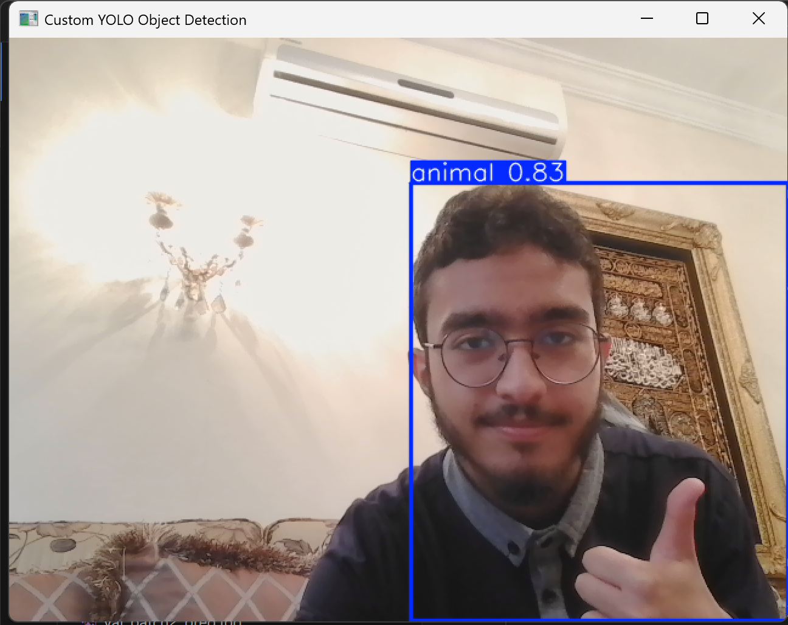
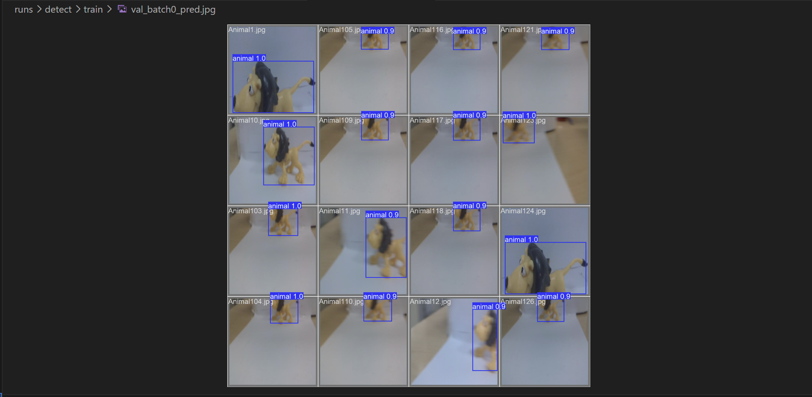

# Custom Object Detection with YOLOv8

This project demonstrates an end-to-end object detection pipeline using YOLOv8, including dataset preparation, model training, evaluation, and real-time webcam deployment.

## Features

- Custom dataset preparation (YOLO format)
- Model training using YOLOv8
- Evaluation with high accuracy (mAP@50: 0.995)
- Real-time object detection using webcam

## Technologies Used

- Python
- Ultralytics YOLOv8 (PyTorch-based)
- OpenCV

## Model Performance

- Precision: 0.999
- Recall: 1.000
- mAP@50: 0.995
- mAP@50-95: 0.964

## How It Works

YOLO (You Only Look Once) is a real-time object detection model that predicts bounding boxes and class probabilities in a single forward pass through a neural network.

The model was fine-tuned on a custom YOLO-formatted dataset and deployed for real-time inference using a webcam.

## Example Output

### Webcam Detection



### Model Prediction



## Installation

```bash
pip install ultralytics opencv-python
```
